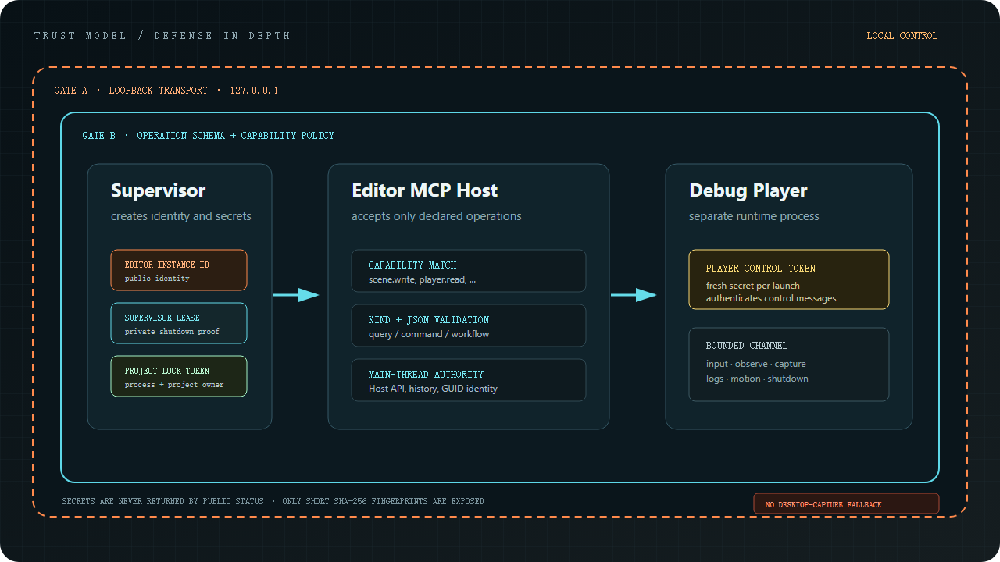

# Trust gates

Infernux MCP uses defense in depth for local agent control. No single token
grants unrestricted engine access, and public status data never contains a
control secret.

## Gate 1: local transport

The MCP Host accepts loopback addresses only. This keeps the endpoint inside the
local development machine, but loopback is not treated as sufficient
authorization by itself.

## Gate 2: operation policy

Every request must name a registered operation and satisfy its
`OperationSchema`. The Host validates the operation kind, JSON argument shape,
and capability required by `ProjectSettings/mcp_capabilities.json` before the
adapter can reach an engine API.

Mutating Editor operations execute on the authoritative Editor path, including
main-thread coordination, history, Undo, and GUID/object/component identity.

## Privileged control tokens

- **Supervisor lease** belongs to one Supervisor-owned Editor session. It proves
  that a privileged normal-shutdown request came from the owning Supervisor.
- **Project lock token** belongs to one Editor instance and project lock. It
  binds the process, project path, endpoint, session, profile, and Editor
  identity together.
- **Player control token** belongs to one Debug Player launch. It proves that a
  request on the bounded Player control channel belongs to that launch.

The Player channel is intentionally narrow: input, observation, engine capture,
logs, motion, and shutdown. A new launch receives a new token.

Status operations expose configuration flags and short SHA-256 fingerprints
where identity comparison is useful. They never return the credential itself.
The project lock token is kept in the local project-lock metadata; the lease and
Player token stay with their owning processes. Lease and Player-control checks
use constant-time secret comparison.

## Observation boundaries

Editor and Player captures read engine render targets and are stored as review
artifacts. Semantic UI data comes from controls rendered by Infernux. There is
no fallback to operating-system desktop capture.

Higher-impact Editor input, semantic UI observation, and Editor capture are
available only in a Supervisor-managed `global_validation` session. Debug
Player capabilities can be granted separately to `developer_assist`, keeping
interactive Editor authority distinct from standalone game validation.
