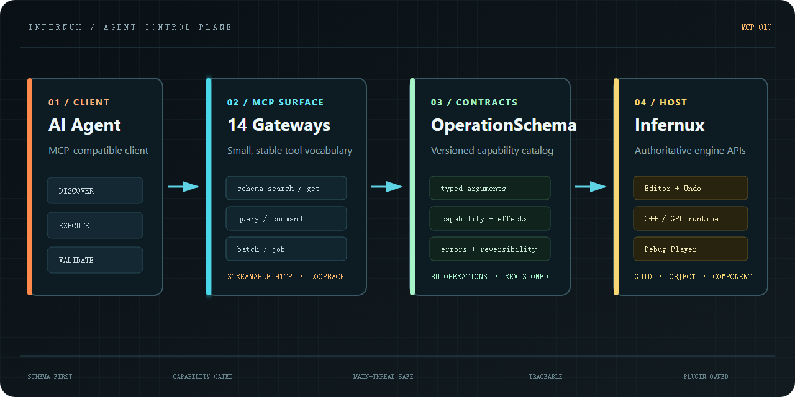

# Infernux MCP

Infernux MCP 是连接兼容 MCP 的 AI Agent 与 Infernux 编辑器的本地控制面。
Agent 可以通过一套有类型、可发现的接口理解项目、创作内容、运行游戏，并从
编辑器或独立 Debug Player 中取得可验证的结果。



插件以 `infernux/mcp` 包安装，在编辑器进程内运行，并通过引擎正式开放的 API
和身份系统完成操作。默认情况下，它为当前项目在
`http://127.0.0.1:9713/mcp` 启动一个独立的 MCP endpoint。

## 为什么使用 Schema Gateway

MCP 表面只保留少量稳定的 gateway；真正的引擎能力则以版本化的
`OperationSchema` 契约发布在 gateway 后方。每份 schema 都会声明：

- 操作属于 query、command、workflow 还是长耗时 job；
- 输入参数和返回值的 JSON 类型；
- 调用它所需的 capability；
- 预期副作用、可逆性、成本和结构化错误。

Agent 先搜索目录，只读取当前任务相关的完整契约，再执行目标 operation。这样
既能限制初始上下文体积，也允许引擎和其它插件持续提供新能力，而不必为每一项
能力都增加一个常驻 MCP tool。


一条可靠的 Agent 工作链是：

1. 查询 Host 能力和当前 session；
2. 按任务意图搜索 operation schema；
3. 读取候选 operation 的完整契约；
4. 通过对应的 query、command、workflow、batch 或 job gateway 执行；
5. 使用状态查询、日志、语义 UI 或渲染截图验证结果；
6. 保存、建立 checkpoint 或提交报告；schema revision 变化后重新发现。

已有资产必须通过 GUID 寻址；场景对象和组件使用查询结果返回的身份标识。
项目修改会进入编辑器正常的事务和 Undo 服务，而不是绕过编辑器直接篡改内部
状态。

## 信任模型与门禁 Token

Infernux MCP 是本地开发接口，而不是面向网络公开的服务。Host 只接受 loopback
地址。每次 operation 调用还会依次校验 schema、JSON 参数、operation kind，
以及 `ProjectSettings/mcp_capabilities.json` 中的项目 capability 策略。


三类短期密钥用于保护具有更高权限的进程边界：

- **Supervisor Lease**：证明正常关闭编辑器的请求确实来自拥有当前 session 的
  Supervisor。
- **Project Lock Token**：把编辑器进程、项目路径、endpoint 和 session 身份
  绑定在一起，使 Supervisor 只能连接或恢复正确的项目实例。
- **Player Control Token**：每次启动 Debug Player 时重新生成，用于认证其受限的
  输入、观察、截图、日志、运动和关闭控制通道。

公开状态接口永远不会返回密钥本身，只会报告凭据是否已配置；需要比对身份时，
最多暴露一段简短的 SHA-256 指纹。这些 token 只负责认证敏感控制通道，不会
绕过 operation schema 或 capability 校验。

完整边界说明见[信任门禁](InxPluginPages/Trust.zh-CN.md)。

## Agent 可以完成什么

- 查询和编辑场景对象、组件、Transform、材质、Particle Graph、相机及使用
  GUID 标识的资产；
- 进入、暂停、单帧步进、恢复和停止 Play Mode；
- 通过引擎事件链注入键盘、指针、滚轮和文本输入；
- 通过 semantic UI snapshot 读取实际绘制的控件；
- 有界读取编辑器 Console 和引擎文档；
- 请求 Scene/Game 渲染目标截图及 GPU object pick；
- 构建、启动、观察、截图、读取日志并关闭受管理的独立 Debug Player；
- 管理验证 attempt、checkpoint、trace 和 blocker report。

编辑器输入、语义 UI 和编辑器渲染截图要求 Supervisor 管理的
`global_validation` session。拥有对应 Player capability 时，
`developer_assist` 也可以验证独立 Debug Player。所有截图都来自引擎渲染
目标；插件不会回退到操作系统桌面截图。

## 快速开始

先搜索 operation：

```json
{
  "tool": "operation_schema_search",
  "arguments": {"query": "scene object create", "limit": 10}
}
```

在依赖参数格式之前，读取返回 operation 的完整 schema，然后通过匹配的
gateway 执行：

```json
{
  "tool": "operation_command_execute",
  "arguments": {
    "operation": "infernux.scene.object.create",
    "arguments": {"kind": "cube", "name": "AgentCube"}
  }
}
```

`infernux.player.build` 等长耗时操作应通过 `operation_job_submit` 提交，再用
`operation_job_status` 查询进度。修改不熟悉的组件属性前，应先调用
`infernux.scene.component.schema`，确认字段类型、枚举值、向量结构、范围和
只读状态。

## 安装

可以在 Infernux 插件管理器中安装 `infernux/mcp`，也可以直接导入其
`.inxpkg` 文件。新项目可以把它列入默认库；它和其它 InxPackage 一样支持
禁用、卸载和重新安装。

默认 endpoint 为 `http://127.0.0.1:9713/mcp`。如需调整，请在启动编辑器前
把 `INFERNUX_MCP_HOST` 设为其它 loopback 地址，或通过
`INFERNUX_MCP_PORT` 修改端口；非 loopback 地址会被拒绝。

## 包结构

- `Editor/infernux_mcp`：MCP server、operation catalog、adapter 和编辑器集成；
- `InxPluginPages`：插件管理器中的说明页面与插图；
- `InxPackage.json`：`infernux/mcp` 的包定义。

本包要求 Infernux `>=0.3.7,<0.4`。
