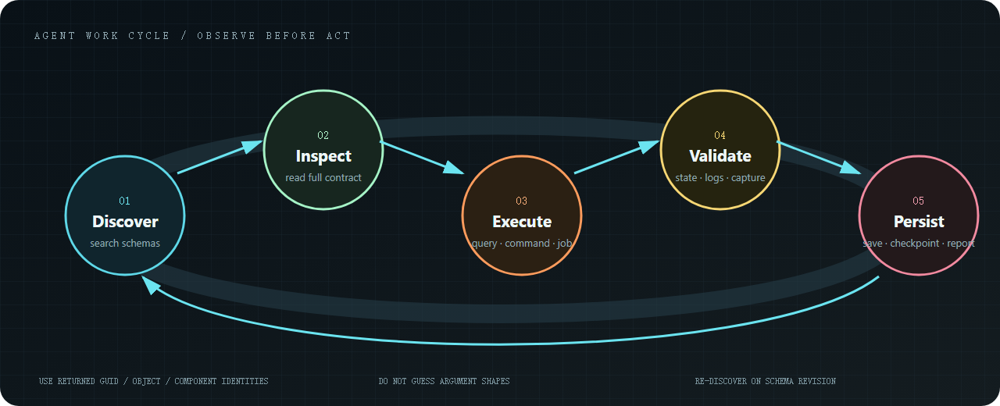

# Usage

This package only exposes a handful of MCP tools. The actual work lives in operations.

1. Search for the operation you need.
2. Read its schema. Do not guess argument names.
3. Call it as a query, a command, or a background job.
4. Keep using the IDs it returned. Assets are GUIDs. Scene objects come from queries.

Before writing an unfamiliar component field, call `infernux.scene.component.schema`.

`infernux.scene.open` and `infernux.scene.reload` return `scheduled: true` when a load is queued. Read `infernux.project.info` afterwards: `active_scene.last_load` contains the requested `path`, `status` (`pending`, `loading`, `loaded`, or `failed`), and the specific `error`. Wait for `loaded` for that path before editing the replacement scene. Also check `active_scene.document_state`: `conflict` means the disk changed again while loading, so the loaded scene is not the latest disk version and the external conflict must be reviewed. A completed MCP job for these operations only confirms that scheduling finished. The previous scene remains active if validation fails.

`active_scene.document_state` identifies an external-file conflict. Resolve it with the editor's reload, keep-local, or save-copy choice before saving. Reload uses the same strict scene format checks as startup, and its dialog displays the parsing error. Correct the reported field in the file before loading it again; component `data` must not contain runtime metadata such as `__type_name__` or `__component_id__`. External editors may use atomic file replacement to save scripts and assets.

Player builds and other slow work should go through `operation_job_submit`. Poll `operation_job_status` instead of waiting on the first call.
